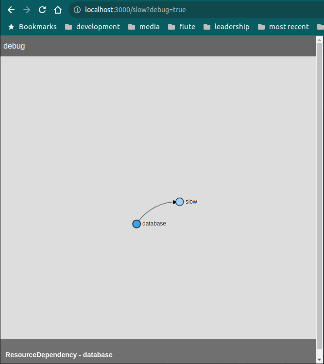
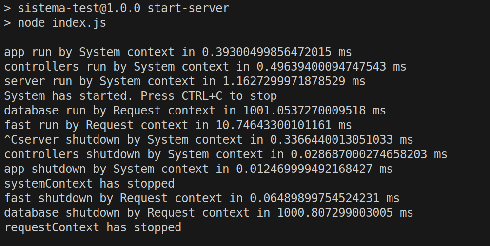
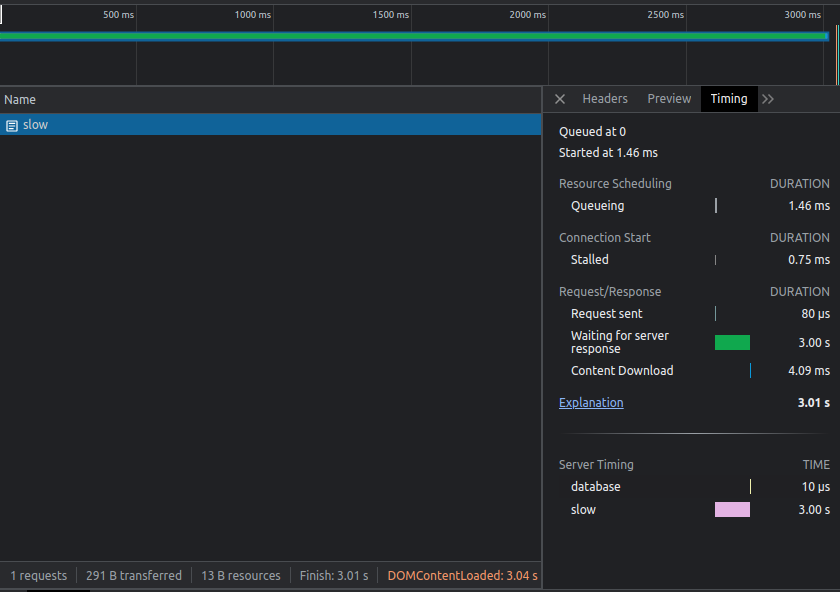

# sistema-test

The following example shows how to use Sistema to wire an application using express.
The application uses 2 contexts:

- a systemContext for all dependencies that are used to start up the application
- a requestContext for all dependencies used in the requests

This starts the server

```
npm run start-server
```

This sends some test requests to the server

```
npm run start-client
```

All dependencies start/stop is logged. So you can verify that this happens in the right order.

# Why

Sistema takes care of:

- Execute dependencies in order
- fulfilling all pending requests, before shutting down the server
- make dependencies easy to test and to mock
- make easy to observe the dependencies and to find the bottlenecks

## Introspection



## Logging



## Timings


